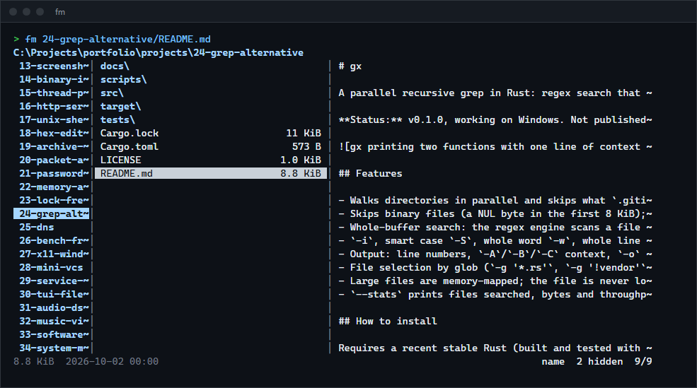
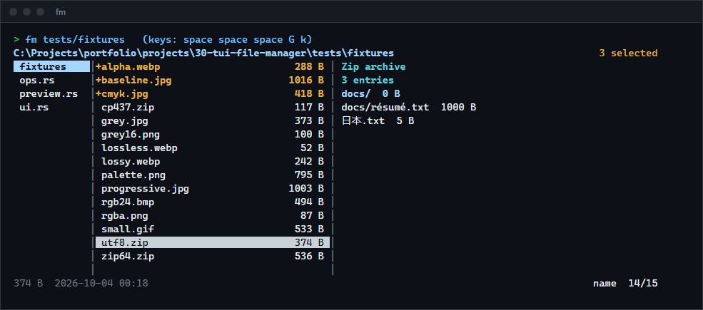
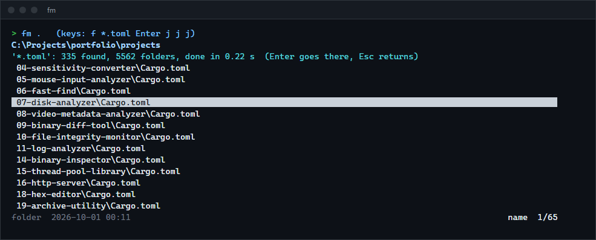

# fm

A terminal file manager with three columns (parent folder, current folder, preview), for people who live in a terminal and want to move around, look into files and copy, move or delete them without leaving it. Previews, copies and searches run on background threads, so a large folder, a slow disk or a 10 GB copy never freezes the screen.

**Status:** v0.1.0, working on Windows. The Linux and macOS code paths are written but were not run. Not published to crates.io; build from source.



## Features

- **Miller columns**: parent, current and preview, with widths set in the configuration (or any of the outer two hidden). Folders are listed first, in natural order (`file9` before `file10`); sort by name, size, time or extension, reversed or not.
- **Previews** of text (UTF-8, UTF-16, Latin-1), a hex dump of binary files, the type of common formats (executables, archives, media, PDF, SQLite), the size of PNG, JPEG, GIF, BMP, WebP and ICO images, the names and sizes inside zip archives (including zip64, `.docx`, `.jar` and self-extracting programs), and the contents of folders.
- **File operations** on the entry under the cursor or a selection: copy, cut and paste, move to the Recycle Bin or trash, delete permanently (asks first), rename, and create files or folders (`a`, then `notes/2026/todo.md` creates the folders on the way). Copies and moves run in the background with progress in the title bar and can be cancelled. Name clashes become `report (1).txt` instead of overwriting.
- **Search**: a filter that narrows the folder as you type (substring or `*` and `?` wildcards, case-sensitive only when you type a capital), and a recursive find whose results stream in while it walks.
- **Bookmarks** under any key (`m` then a key to set, `'` then the key to jump, `''` to go back), saved between sessions.
- **Goto** a typed path with Tab completion, `~` and `..`; a file path opens its folder with the file selected. On Windows, the parent of a drive is the list of drives.
- **Open** files with their default program (Enter) or in `$EDITOR` (`e`).
- Watches the folder you are in and shows changes made by other programs within a second.
- Every key can be rebound in a configuration file.
- `--cd-file` writes the folder you quit in, so a shell function can change to it.

## How to install

Requires a recent stable Rust (built and tested with 1.98.1).

```sh
git clone https://github.com/r3clusionn/tui-file-manager
cd tui-file-manager
cargo install --path .
```

This installs the `fm` binary.

## How to use

```sh
fm                    # the current folder
fm ~/projects         # a folder
fm notes/todo.md      # a file's folder, with the file selected
```

| Keys | What they do |
|---|---|
| `j` `k`, arrows, `PgUp` `PgDn`, `g` `G` | Move, by page, to the first or last entry. |
| `l`, Enter, Right | Enter a folder, or open a file with its program. |
| `h`, Backspace, Left | Go to the parent folder (the cursor lands on the folder you came from). |
| `-`, `~`, `:` | Previous folder, home folder, go to a typed path (Tab completes). |
| `/`, `f` | Filter this folder as you type; find by name in this folder and below. |
| Space, `ctrl-a`, `v`, Esc | Select and move down, select all, invert, clear the filter (or else the selection). |
| `y`, `x`, `p` | Copy, cut, paste. `ctrl-c` cancels a running copy or move. |
| `d`, `D` | Move to the trash; delete permanently (asks `y`/`n`). |
| `r`, `a`, `e` | Rename, create (end the name with `/` for a folder), edit in `$EDITOR`. |
| `m` key, `'` key, `b` | Set a bookmark, jump to one, list them. |
| `.`, `s`, `S`, `i` | Hidden files, next sort key, reverse sort, preview on or off. |
| `J`, `K` | Scroll the preview. |
| `?` or F1, `q` | All keys, quit. |





### Configuration

`fm` reads `config.toml` and keeps `bookmarks` in `%APPDATA%\fm` on Windows, `$XDG_CONFIG_HOME/fm` or `~/.config/fm` elsewhere, or the folder in `$FM_CONFIG_DIR` or `--config`. Every setting is optional; unknown names are an error that says which one.

```toml
[layout]
columns = [1, 3, 4]          # parent, current, preview widths; 0 hides a column
info = ["size", "modified"]  # shown after each name
borders = true

[view]
show_hidden = false
sort = "name"                # name, size, modified, extension
reverse = false
dirs_first = true

[keys]
"ctrl-n" = "down"            # action names are listed by ? in fm
"q" = "none"                 # unbind
"ctrl-q" = "quit"

editor = "nvim"              # otherwise $VISUAL, $EDITOR, then notepad or vi
```

### Changing to the last folder on exit

PowerShell (in `$PROFILE`):

```powershell
function f { $t = New-TemporaryFile; fm --cd-file $t @args; Set-Location (Get-Content $t); Remove-Item $t }
```

bash or zsh:

```sh
f() { t=$(mktemp); fm --cd-file "$t" "$@"; cd "$(cat "$t")"; rm -f "$t"; }
```

### Replaying keys

`--keys` replays comma-separated key names without a terminal and prints the final screen; background work is waited for after each key, so the result is the same every time. It is how the tests and the screenshots here are made. Names are single characters, `text:abc` (types the characters), `esc`, `enter`, `tab`, `space`, `comma`, arrows, `pgup`, `pgdn`, `home`, `end`, `backspace`, `delete`, `f1` to `f12` and `ctrl-x`. `--screen WxH` sets the size and `--ansi` keeps the colours.

```sh
fm . --keys "f,text:*.toml,enter" --screen 100x20
```

## How it works

- **The screen is data.** `App::handle_key` is a state machine and `App::render` returns lines of styled text; neither touches a terminal. `src/term.rs` is a short crossterm loop that draws only the lines that changed and, between keys, asks the app to collect results from its background threads.
- **Previews off the main thread.** A pool of four workers takes requests from a single slot: a new request replaces one that no worker has started, so holding `j` through a folder of a thousand files asks for a few previews, not a thousand. Finished previews go into a cache keyed by path, size, time and column width. The interface shows `loading...` until the preview arrives and never waits for it.
- **Jobs.** Copies, moves and deletes run one at a time on a job thread that reports progress every 50 ms. On Windows a file is copied with `CopyFileExW`, which keeps attributes, times and alternate data streams and deletes a half-copied file when the copy is cancelled from its progress callback; elsewhere it is a 1 MiB buffered loop that removes the partial file itself. A move is a rename; across volumes it becomes a copy followed by deleting the source only if every file arrived. Links are copied as links and deleted as links: a deleted link to a folder, or a Windows junction, never takes the folder's contents with it.
- **Zip listings** read the central directory from the end of the file and locate it relative to the end record rather than by its stored offset, which is what makes archives with data in front of them (self-extracting programs) readable, as Python's `zipfile` and Info-ZIP do.

## Measurements

Intel Core i9-14900KF, 32 GB, Windows 11, a WD SN740 NVMe SSD (C:), Rust 1.98.1, release build. `cargo run --release --example bench -- dir 100000` for the folder numbers; `scripts/bench_copy.py` for the copies.

| A folder of 100,000 empty files | Median |
|---|---|
| Open: read, sort and draw the first frame | 94 ms (5 runs) |
| A key press and the new frame, 160x50 | 0.13 ms (400 presses; the slowest 0.43 ms) |
| Filtering all 100,000 names again after a typed character | 12.6 ms (5 runs) |

The frame time is the time to build the frame, not to print it; printing is up to the terminal.

Copies, C: to C:, five rotated rounds, median (the source files were in the cache, and each time is until the tool returned, so the last data may still have been in the write cache):

| Copy | fm | robocopy | xcopy |
|---|---|---|---|
| One 2 GiB file | 0.86 s | 0.84 s | 0.74 s |
| 10,000 files of 4 to 60 KiB in 800 folders (about 310 MiB) | 3.23 s | 3.10 s | 3.16 s |

The run-to-run spread (0.72 to 1.30 s for fm on the large file, 0.66 to 1.15 s for xcopy) is wider than the differences, so the three are the same speed here: all of them are bounded by the file system, and fm's job thread and progress reports cost nothing measurable.

## Verification

- `cargo test --release`: 51 tests (20 unit tests, 10 of file operations, 6 of previews, 15 of the interface). Clippy reports nothing.
- **Previews against Python.** `scripts/check_previews.py` runs the previewer over every zip-like file and image under the folders it is given and compares with Python's `zipfile` (every name and size) and Pillow (format, width and height). Over Program Files, parts of Windows, installed programs (including Go's and Python's own corrupt-archive test files) and the cargo registry, all 542 archives and all 43,407 images agree; 155 files that Python itself cannot open were skipped. While building it, this comparison found real problems that the hand-made fixtures did not: JPEG frame headers behind more than 64 KiB of metadata, zip names stored with backslashes, archives with data in front of them, and icons whose directory says 256 pixels for a 512-pixel image (and the rule for which of an icon's images counts).
- **File operations against a model.** 12 rounds of 60 random creates, renames, copies, moves and deletes, with the tree on disk compared to an in-memory model after every step (including the `name (1)` naming and refusing to copy a folder into itself). Separate tests cover a move from C: to another volume (D:) with `FM_TEST_OTHER_VOLUME`, cancelling a 256 MiB copy (no partial file is left), read-only files, symbolic links and junctions (deleting either leaves the target intact), and the Recycle Bin (the item is found there, then purged so the test leaves nothing behind).
- **Interface.** 15 tests drive the app with keys in temporary folders: navigation and remembered cursors, filtering, find, bookmarks surviving a restart, goto and completion, key rebinding, a changed folder showing up, and the folder being deleted under it. One test gives every preview a 300 ms delay and checks that four key presses with their frames still take under 100 ms.
- **A real console.** The tests above do not cover crossterm's raw mode and key events, so `scripts/console_test.ps1` starts `fm` in a console window and types into it with `SendKeys`: create a file, copy one from a subfolder, rename the copy, enter the subfolder and quit. The files on disk, the exit code and the `--cd-file` output were all as expected.

## Limits

- Tested on Windows 11 only. The trash on Linux and macOS goes through the `trash` crate and was not run; executable detection there uses the mode bits.
- Previews are text only: no images in the terminal (the preview gives the image's size), no syntax colouring, no PDF text.
- One job runs at a time; further pastes queue behind it. There is no undo; use the trash (`d`) for things you may want back.
- Folders are watched by polling their modification time once a second. Changes to a file's size without a new or removed entry show up on the next reload (`ctrl-r`).
- A single slow preview occupies one of the four workers until it finishes; four very slow files at once delay further previews (but never the keys).
- No tabs, split panes, mouse support, archive extraction or remote file systems.

## License

MIT (see `LICENSE`).
